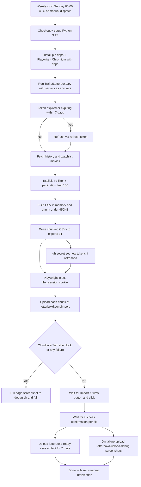

# Trakt2Letterboxd — Headless CI/CD Refactor Plan

Goal: turn the interactive `Trakt2Letterboxd.py` into a fully automated, weekly
Trakt → Letterboxd sync that runs in GitHub Actions, exports Letterboxd-ready
CSVs, and uploads them to Letterboxd via Playwright with zero manual intervention.

---

## 1. Structural decisions

### 1.1 Authentication — replace interactive OAuth with env-var tokens
- Remove the hardcoded client ID/secret (original author's keys — a leak) and the
  interactive device-code polling flow.
- Credentials come exclusively from env vars:
  - `TRAKT_CLIENT_ID`
  - `TRAKT_CLIENT_SECRET`
  - `TRAKT_ACCESS_TOKEN`
  - `TRAKT_REFRESH_TOKEN`
  - `TRAKT_TOKEN_EXPIRES_AT` (epoch seconds; computed from `created_at + expires_in`
    at token bootstrap time, updated after every refresh)
- **Refresh strategy (satisfies the 3-month expiry requirement):**
  - Proactive: if `TRAKT_TOKEN_EXPIRES_AT` is present and `now >= expires_at - 7 days`,
    refresh *before* making API calls, so the weekly cron has a full week of runway.
  - Reactive fallback: any HTTP 401 from the Trakt API triggers an immediate refresh
    and one retry (covers drift between bootstrap and first run).
  - Each refresh calls `POST /oauth/token` with `grant_type=refresh_token` and stores
    the returned `access_token`, `refresh_token` (Trakt rotates it), and the new
    `expires_at = created_at + expires_in`.
  - New tokens are emitted to `GITHUB_OUTPUT` (`token_refreshed=true`,
    `trakt_access_token`, `trakt_refresh_token`, `trakt_token_expires_at`) so the
    workflow can run `gh secret set`. For local runs, the same lines print to stdout.
- **Rejected alternative:** pushing a token JSON file back to the repo. Even a
  "locked" file is permanently captured in git history if ever committed; secret
  updates via `gh secret set` never touch the repo.
- If a refresh fails with 401 (refresh token dead after inactivity), the script exits
  non-zero with a clear message pointing at `SETUP.md` recovery steps.

### 1.2 Data fetching — movies only, faster pagination
- Keep the two existing sources: `/sync/history/movies` and `/sync/watchlist/movies`.
- Raise pagination `limit` from 10 to 100 and honor `X-Pagination-Page-Count`.
- **Explicit TV filter:** every entry must contain a `movie` object; entries with a
  `show` key or without `movie` are skipped (defense in depth, per requirement).
- Keep original Letterboxd columns: `WatchedDate, tmdbID, imdbID, Title, Year`.
  No pandas — stdlib `csv` keeps CI dependencies light.

### 1.3 CSV chunking — under 1MB each
- Build the full CSV in memory (`io.StringIO`, UTF-8).
- Measure byte size; if `> 950KB` (buffer under Letterboxd's strict 1MB cap), split
  rows into consecutive chunks such that header + rows stay under the cap.
- Repeat the exact header row at the top of **every** chunk.
- Output naming: `letterboxd_history_part1.csv`, `letterboxd_history_part2.csv`, ...
  and `letterboxd_watchlist_part1.csv`, ... written to `exports/` (gitignored).
- If no rows, emit an info message and no file.

### 1.4 Playwright uploader — zero manual intervention
- Dependencies: `playwright` + `playwright-stealth` (pin `playwright-stealth==1.0.13`;
  verify the `Stealth().apply_stealth(page)` API during implementation).
- **No username/password login.** Authenticate by injecting the `lbx_session` cookie
  from `LETTERBOXD_SESSION_COOKIE` secret:
  - New browser context → `context.add_cookies([...])` with
    `{name: lbx_session, value, domain: .letterboxd.com, path: /, secure: true}`
    → THEN navigate (cookie must exist before first navigation to `letterboxd.com`).
- **Upload flow (sequential, one file at a time for deterministic confirmation):**
  1. `page.goto('https://letterboxd.com/import/')`
  2. Check auth actually took: if redirected to `/login` or a prominent "Sign in"
     prompt appears, screenshot + fail with "session cookie invalid/expired".
  3. `set_input_files` on `input[type="file"]` (first match; the import page's
     drag-drop zone input).
  4. Wait for the confirmation button via resilient text locator:
     `button:has-text("Import")` / regex `Import\s+\d+\s+films?` (up to 60s).
  5. Click it; wait for success state (page text like "import complete" /
     "import has started", up to 60s). Record success per file.
  6. Repeat for the next chunk.
- **Cloudflare / Turnstile detection:** check for
  `iframe[src*="challenges.cloudflare.com"]`, `.cf-turnstile`, or text
  "Verify you are human" / "Checking your browser". On detection → full-page
  screenshot → raise.
- **Failure handling:** any stage failure → full-page screenshot to `debug/`
  (gitignored) sized `debug/timestamp_stage.png`, then non-zero exit so the workflow
  uploads `debug/` as an artifact for inspection.

### 1.5 GitHub Actions workflow (`.github/workflows/trakt-sync.yml`)
- Triggers: `schedule` cron `0 0 * * 0` (Sunday 00:00 UTC) + `workflow_dispatch`.
- `runs-on: ubuntu-latest`; `permissions: contents: read, secrets: write`
  (`secrets: write` is required for `gh secret set` with `GITHUB_TOKEN`).
- `concurrency` group so weekly cron and manual runs never overlap.
- Steps:
  1. `actions/checkout@v4`
  2. `actions/setup-python@v5` — `python-version: '3.12'`, pip cache
  3. `pip install -r requirements.txt`
  4. `python -m playwright install --with-deps chromium`
  5. Run `python Trakt2Letterboxd.py` with all 6 secrets passed via `env`
     (never interpolated into the shell command line); `GITHUB_OUTPUT` auto-injected.
  6. If `steps.trakt.outputs.token_refreshed == 'true'`: `GH_TOKEN=GITHUB_TOKEN`
     and `gh secret set TRAKT_ACCESS_TOKEN/TRAKT_REFRESH_TOKEN/TRAKT_TOKEN_EXPIRES_AT`.
  7. `actions/upload-artifact@v4`: `letterboxd-ready-csvs`, path `exports/*.csv`,
     `retention-days: 7`, `if-no-files-found: error`.
  8. `actions/upload-artifact@v4` (only on `failure()`): `letterboxd-upload-debug`,
     path `debug/`, `retention-days: 7`, `if-no-files-found: ignore`.

### 1.6 Setup guide (`SETUP.md`)
- Create a Trakt API app at `https://trakt.tv/oauth/applications/new`
  (redirect URI `urn:ietf:wg:oauth:2.0:oob` for device flow) → client ID + secret.
- Bootstrap initial tokens via cURL device-code flow:
  1. `POST /oauth/device/code` with `client_id` → note `user_code`, `verification_url`
  2. Open URL, enter code, approve
  3. Poll `POST /oauth/device/token` with `code`, `client_id`, `client_secret` →
     returns `access_token`, `refresh_token`, `expires_in`, `created_at`
  4. `TRAKT_TOKEN_EXPIRES_AT = created_at + expires_in` (compute or via `jq`/python)
- Extract `lbx_session`: DevTools → Application → Cookies → `letterboxd.com` →
  copy the `lbx_session` value.
- Secret checklist (6 repo secrets) + recovery steps.
- Postman variant briefly noted as an alternative to cURL.

### 1.7 Misc
- Update `.gitignore`: `exports/`, `debug/`, `__pycache__/`, keep `*.csv` protection.
- Update `README.md` with a pointer to the new automated flow + `SETUP.md`.
- CLI: `--skip-upload` flag for local export-only testing; `--lists history|watchlist|all`
  (default `all`).
- Local validation: run export-only, assert chunk byte sizes < 950KB, headers present
  in every chunk, no TV entries.

---

## 2. Workflow diagram

---

## 3. Files to create / modify

| File | Action |
|---|---|
| `Trakt2Letterboxd.py` | Rewrite (auth, fetch, filter, chunk, upload, CLI) |
| `requirements.txt` | Create (`requests`, `playwright`, `playwright-stealth`) |
| `.github/workflows/trakt-sync.yml` | Create |
| `SETUP.md` | Create |
| `README.md` | Update (pointer to automated flow) |
| `.gitignore` | Update (exports/, debug/, __pycache__/) |

## 4. Security notes

- No credentials ever committed; all via repo secrets; tokens only referenced as env
  vars, never interpolated into shell strings.
- `gh secret set` requires `secrets: write` workflow permission.
- Scheduled runs only fire on the default branch of the fork with Actions enabled.
- Hardcoded original-app keys removed from the codebase.