# Trakt2Letterboxd — Mobile One-Tap Letterboxd Cookie Refresh Plan

## Goal

When the Letterboxd session cookies expire, the user refreshes the GitHub
Actions secrets from a **phone with one tap on a link printed in the workflow
summary**. No extensions, no desktop tooling, no cookie pasting, and the
refresh works on any phone browser (iOS Safari and Android Chrome included).

The user accepts **one re-login per expiry** (session cookies live weeks to
months; the weekly sync itself never needs the phone). Re-login happens only
when the session dies, not on every sync.

## Hard constraints that shape the design

1. `letterboxd.user.CURRENT` is **httpOnly**, so no in-page JavaScript on any
   mobile browser can ever read it. Only a server-side browser can capture it
   in this design.
2. GitHub does **not** allow the built-in `GITHUB_TOKEN` to write repository
   secrets. Self-service secret updates need a fine-grained PAT with `Secrets`
   write on this repo, stored once as `SECRETS_PAT`.
3. GitHub runners cannot reach the user's browser, so the capture must happen
   in a browser **GitHub hosts**, with the user logging in through it.
4. `cf_clearance` is bound to the IP and user agent that solved the Cloudflare
   challenge. The refresh creates it on a GitHub runner, but GitHub-hosted
   runners use dynamic IPs and the later sync may run elsewhere. The session
   and CSRF cookies remain reusable; a later sync may still need a new
   Turnstile challenge if `cf_clearance` is rejected.

## Architecture

```mermaid
flowchart LR
  A[Weekly trakt-sync workflow] -->|cookies expired| B[Emit tap-link in job summary]
  B -->|user taps on phone| C[refresh-letterboxd-cookies workflow run]
  C --> D[Launch headful Chromium on runner under Xvfb]
  D --> E[Expose display through x11vnc + noVNC]
  E --> F[Start anonymous Cloudflare quick tunnel]
  F --> G[Print tap-to-login link in step summary]
  G --> H[User logs into Letterboxd in the remote browser]
  H --> I[Poll until login form disappears]
  I --> J[Read session CSRF cf_clearance cookies]
  J --> K[gh secret set via SECRETS_PAT]
  K --> L[Re-dispatch trakt-sync workflow]
  L --> A
```



## Components

### 1. `scripts/refresh_server.py` (new)

Single script the refresh workflow runs. Responsibilities:

- Launch Playwright Chromium headful under Xvfb, reusing the same stealth and
  user-agent approach as [`LetterboxdUploader`](Trakt2Letterboxd.py:323).
- Start `x11vnc` against the Xvfb display and `websockify` with the installed
  noVNC web assets. The VNC server listens only on localhost, and websockify
  requires a random one-run token.
- Start an anonymous Cloudflare quick tunnel
  (`cloudflared tunnel --url http://127.0.0.1:6080`) and scrape the
  `*.trycloudflare.com` URL from `cloudflared`'s log output.
- Print a single markdown block to stdout (captured into the step summary):

  ```markdown
  ## Letterboxd cookies expired - tap to refresh

  Tap this link on your phone and log in to Letterboxd in the window that opens:
  **https://<random>.trycloudflare.com/vnc.html?...&token=<random>**

  Your session is captured automatically once you are logged in.
  ```

- Navigate the runner-side Playwright page to `https://letterboxd.com/login/`
  and wait (default 20 minutes, constant-driven) for the user to finish the
  login in the noVNC window.
- Poll until the user is logged in, reusing the existing login-form detection
  logic ([`_session_cookie_expired`](Trakt2Letterboxd.py:477) inverted).
- The user completes any Cloudflare Turnstile challenge interactively in the
  remote browser - no stealth hack is needed for login. The resulting
  `cf_clearance` is captured when available, but may be rejected by a later
  GitHub-hosted sync job if its dynamic IP differs.
- Read the three cookies from the Playwright context for `.letterboxd.com`:
  `letterboxd.user.CURRENT`, `com.xk72.webparts.csrf`, `cf_clearance`.
- Update the GitHub secrets through the `gh` CLI (pre-installed on runners):

  ```bash
  gh secret set LETTERBOXD_SESSION_COOKIE --body "$SESSION" --repo OWNER/REPO
  gh secret set LETTERBOXD_CSRF_COOKIE --body "$CSRF" --repo OWNER/REPO
  gh secret set LETTERBOXD_CF_CLEARANCE --body "$CF" --repo OWNER/REPO
  ```

  using `GH_TOKEN=$SECRETS_PAT` (fine-grained PAT, `Secrets` read/write, this
  repository only).
- Re-dispatch the sync workflow:

  ```bash
  gh workflow run trakt-sync.yml --repo OWNER/REPO
  ```

- Print a completion line ("Secrets updated; sync re-triggered.").
- On timeout or failure, screenshot into `debug/` and exit non-zero.

### 2. `.github/workflows/refresh-letterboxd-cookies.yml` (new)

- Triggered by `workflow_dispatch`; `concurrency` group shared with the sync
  workflow so refresh and sync never overlap.
- Same dependency setup as [`trakt-sync.yml`](.github/workflows/trakt-sync.yml:21)
  plus Xvfb and `cloudflared` (downloaded binary from the official release;
  anonymous quick tunnels need no auth token).
- Environment: `GH_TOKEN: ${{ secrets.SECRETS_PAT }}` and `REPO` from
  `${{ github.repository }}`.
- Runs `xvfb-run python scripts/refresh_server.py`, then uploads `debug/` on
  failure.
- `permissions: contents: read` only - all secret writes go through the PAT,
  never `GITHUB_TOKEN`.

### 3. `.github/workflows/trakt-sync.yml` (modified)

- Keep the existing job unchanged, but handle the expired-cookie failure path:
  - Keep the existing [`RuntimeError`](Trakt2Letterboxd.py:633) message.
  - Add a step after the run step that, on failure, appends to
    `$GITHUB_STEP_SUMMARY`:

    ```markdown
    ### Letterboxd session expired

    Refresh cookies from your phone with one tap:
    [Open cookie refresh](https://github.com/OWNER/REPO/actions/workflows/refresh-letterboxd-cookies.yml)
    ```

  - Optionally auto-dispatch the refresh workflow (`gh workflow run
    refresh-letterboxd-cookies.yml` with `SECRETS_PAT`) so the runner browser
    is warm when the user taps the link.
- The dispatch link in the summary is the fallback if auto-dispatch is off.

### 4. `SETUP.md` (modified)

- New section "Self-service cookie refresh from your phone":
- Create a fine-grained PAT scoped to this repo with **Actions: Read and write**
  and **Secrets: Read and write**, then add it as `SECRETS_PAT`.
  - Explain the tap-to-login flow: tap link on phone, log in once, done.
- Update the troubleshooting row "Letterboxd asks for login" to point at the
  one-tap refresh instead of manual DevTools extraction.

## Security notes

- The tap-link is protected by the random `*.trycloudflare.com` hostname and a
  random websockify token; it is printed only in the workflow summary.
- The phone's login input travels through the short-lived HTTPS/WSS tunnel to
  the runner's browser; the browser then submits the login directly to
  `letterboxd.com`. No repository application receives or stores the password,
  but the tunnel provider must be trusted for transport security.
- The tunnel lives only for the duration of one workflow run; the runner is
  then destroyed.
- `SECRETS_PAT` is write-scoped to this repository's secrets only and is never
  printed or committed.
- Cloudflare Turnstile during login is solved interactively by the user in the
  remote browser. The resulting `cf_clearance` can be stored, but dynamic
  GitHub runner IPs mean a later sync may challenge again.

## Validation

- `python -m py_compile scripts/refresh_server.py`.
- noVNC serves the temporary browser and rejects a connection without the
  generated websockify token.
- Summary output contains exactly one clickable link.
- `gh secret set` updates all three secrets against a throwaway repository.
- Successful refresh re-dispatches `trakt-sync.yml`.
- Sync workflow's failure path emits the refresh link without renaming the
  existing secrets.
